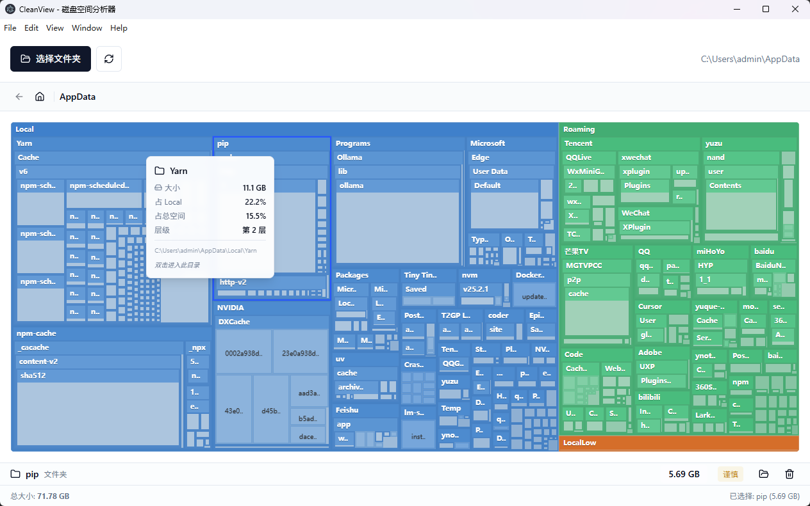

# CleanView - 磁盘空间分析器

用树状图可视化磁盘占用的 Electron 桌面应用，支持选择目录、钻取子目录、查看详情与删除文件/夹。



## 功能

- 选择文件夹进行磁盘空间分析
- 树状图展示各目录/文件占比，块大小与占用成正比
- 悬停或点击查看详情（大小、占比、层级、路径）
- 双击进入子目录
- 支持删除选中的文件或文件夹

## 开发与运行

**环境:** Node.js 18+

**安装与运行:**

```bash
git clone <仓库地址>
cd clean-view
npm install
npm run start
```

**打包:**

```bash
npm run make
```

**技术栈:** Electron + React + Vite + D3/Recharts 树状图

## License

MIT
